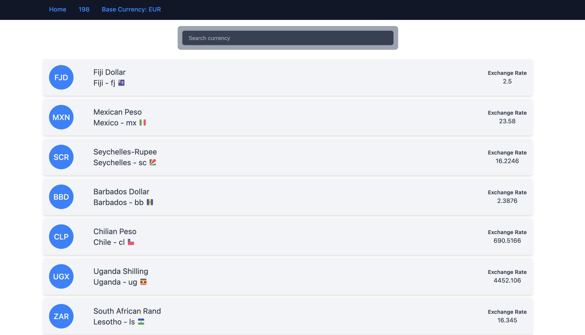

# Currencies exchange rate viewer for George FE Test ✨
 
A SPA that displays all the currencies from the bank and their respective exchange rate. For each currency we have:

- Country flag
- Country Name
- Currency
- Exchange rate

The currencies are searchable and this is also preset (state) in the url for deep linking. On scroll the search input sticks at the top.

## Initial Setup
First install all the packages.

To setup, first run:

`npm run setup`

Alternatively, you can also do:

`npm install`

## Server
The application uses a json-based server for full FAKE apis for a mock server for the FE. This is to simulate a real server where the client retrieves data from the server. Check the network request during application run, data is fetched from the server.

### The application cannot run if the server is not started!
**Note**
- server may need to be installed globally if local project one does not work. In that case run `npm install -g json-server`

Start Server - runs on port 4201

`npm run server`

## Start the app

To start the development server run:

`npm run start`.

Opens the browser and navigate to http://localhost:4200/

## Ready to deploy?

Run `npm run build` to build the application. The build artifacts will be stored in the `dist/` directory, ready to be deployed.

## Tests

** Note **
- server has to be running before running the tests. 

For E2E test, using Cypress run:

`npm run e2e`

For E2E headless, run and follow the prompt:

`npm run e2e-headless`

The results are stored in dist/cypress/e2e/videos folder

For Unit Tests, using jest run:

`npm run test`

## Maintenance

## Tech stack
- ReactJs
- TypeScript
- Redux Toolkit, RTK-Query
- TailwindCss

## Other Tech stack
- Nx.dev
- Jest
- Cypress
- Json-server

